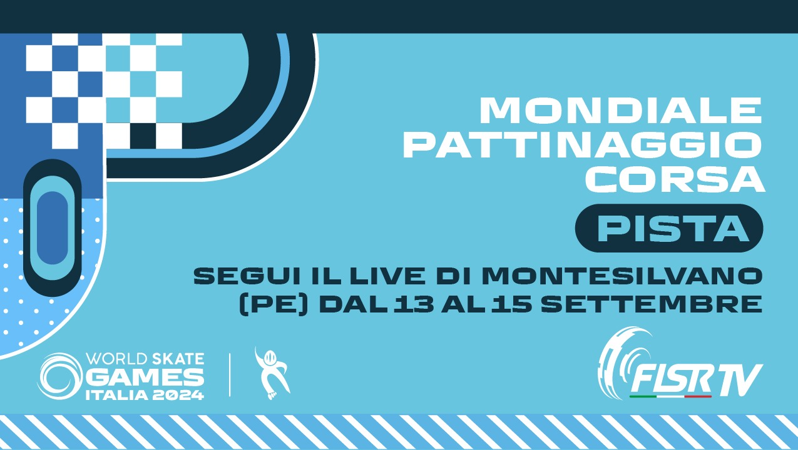
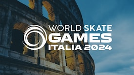
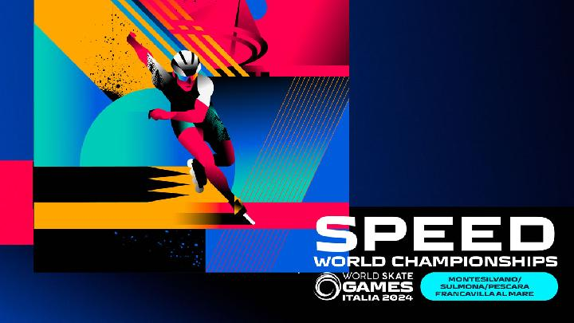
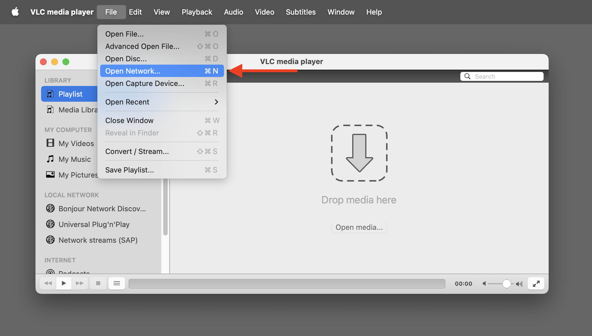
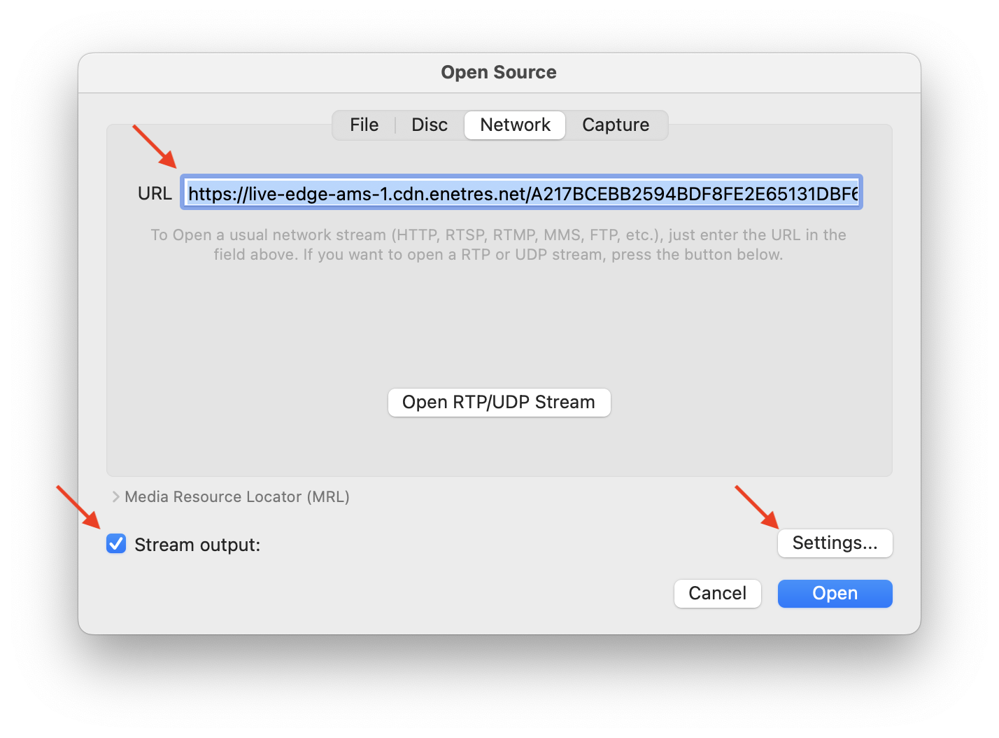
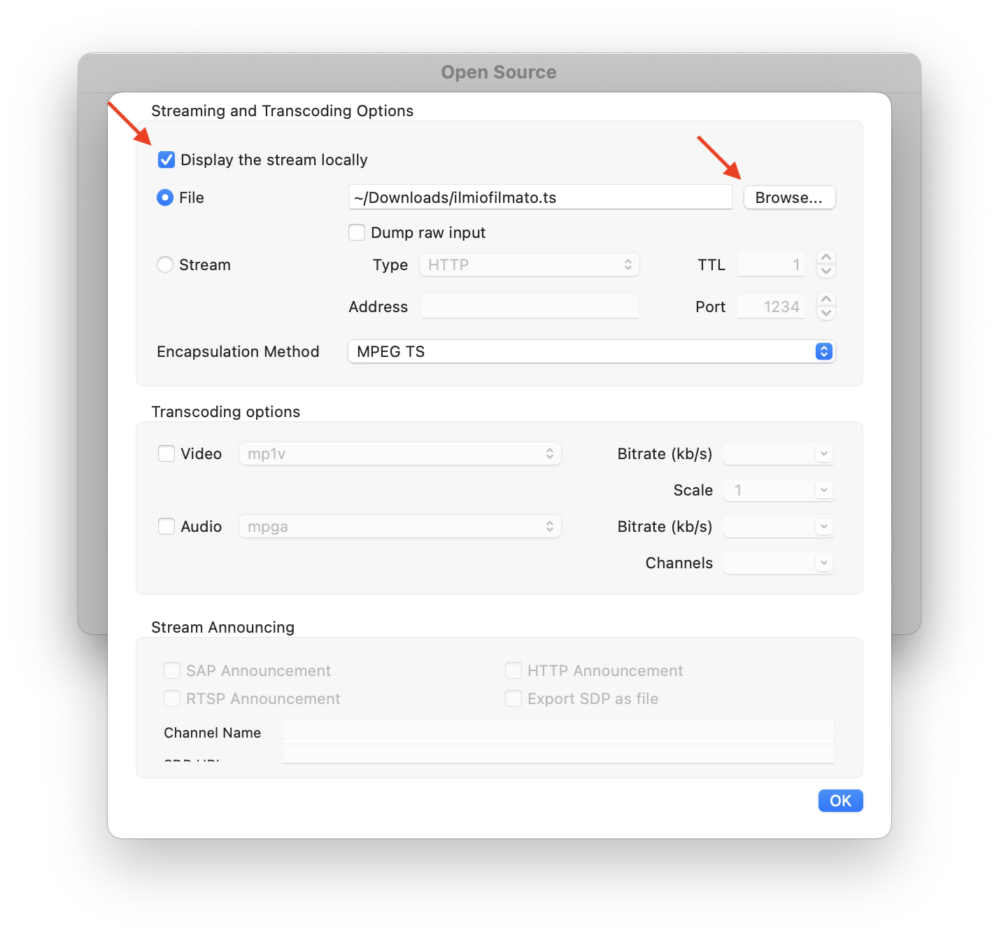

# WSG2024-video

Copiare questi indirizzi e incollarli nel *browser* per guardare la trasmissione **senza bisogno di un account**.

Questi indirizzi possono essere incollati su [VLC](https://www.videolan.org/vlc/) (o su applicazioni simili) per registrare il video nel computer ([istruzioni](#registrare-con-vlc)).

## FISR TV ([link al sito](https://fisrtv.it/))

### Trasmissione *"Pista Live Di Montesilvano dalle 8:30 del 13 settembre"*

- `https://play.cdn.enetres.net/A217BCEBB2594BDF8FE2E65131DBF663023/022299/playlist.m3u8`
- `https://live-edge-ams-1.cdn.enetres.net/A217BCEBB2594BDF8FE2E65131DBF663023/live-corsa-it/index.m3u8`

## Rai Play ([link al sito](https://www.raiplay.it/guidatv?channel=rai-sport))

Al momento non ci sono indirizzi diretti.

## World Skate TV ([link al sito](https://worldskate.tv/world-skate-games/wsg-2024/wsg-inline-speed-2024))

### Trasmissione *"13/09/2024 07:00"*

- gli stessi della FISR?

### Download

La World Skate permette il download di queste registrazioni (dalla più recente alla più vecchia pubblicata):

| LINGUA | TITOLO | INDIRIZZO |
|---|---|---|
| :uk: inglese  | 1000 m Senior Men Qualification | [download](https://progressive.enetres.net/getMedia.php?u=A217BCEBB2594BDF8FE2E65131DBF663&c=008&f=b60f2c9a2fbf-140924-101229-liveen.mp4) |
| :uk: inglese  | 10000 m Senior Men Final | [download](https://progressive.enetres.net/getMedia.php?u=A217BCEBB2594BDF8FE2E65131DBF663&c=008&f=8427cbedf6a5-140924-101229-liveen.mp4) |
| :uk: inglese  | 1000 m Senior Women Qualification | [download](https://progressive.enetres.net/getMedia.php?u=A217BCEBB2594BDF8FE2E65131DBF663&c=008&f=450c76ebc9da-140924-101229-liveen.mp4) |
| :uk: inglese  | 500 m Junior Men Qualification | [download](https://progressive.enetres.net/getMedia.php?u=A217BCEBB2594BDF8FE2E65131DBF663&c=008&f=7e35c87f3a53-140924-101229-liveen.mp4) |
| :uk: inglese  | 500 m Junior Women Qualification | [download](https://progressive.enetres.net/getMedia.php?u=A217BCEBB2594BDF8FE2E65131DBF663&c=008&f=891a53f4cfbc-140924-101229-liveen.mp4) |
| :uk: inglese  | 10000 m Senior Women Final | [download](https://progressive.enetres.net/getMedia.php?u=A217BCEBB2594BDF8FE2E65131DBF663&c=008&f=00850387c031-140924-101229-liveen.mp4) |
| :uk: inglese  | 5000 m Junior Men Final | [download](https://progressive.enetres.net/getMedia.php?u=A217BCEBB2594BDF8FE2E65131DBF663&c=008&f=13d630c2e2e9-140924-101229-liveen.mp4) |
| :es: spagnolo | 1000m Senior Men Qualification | [download](https://progressive.enetres.net/getMedia.php?u=A217BCEBB2594BDF8FE2E65131DBF663&c=008&f=7f9b2cc0111b-140924-101230-livees.mp4) |
| :es: spagnolo | 1000m Senior Women Qualification | [download](https://progressive.enetres.net/getMedia.php?u=A217BCEBB2594BDF8FE2E65131DBF663&c=008&f=11b2e600365d-140924-101230-livees.mp4) |
| :es: spagnolo | 500m Junior Men Final | [download](https://progressive.enetres.net/getMedia.php?u=A217BCEBB2594BDF8FE2E65131DBF663&c=008&f=eaf86c1f0956-140924-101230-livees.mp4) |
| :es: spagnolo | 500m Junior Women Qualification | [download](https://progressive.enetres.net/getMedia.php?u=A217BCEBB2594BDF8FE2E65131DBF663&c=008&f=cec4e9d197dd-140924-101230-livees.mp4) |
| :es: spagnolo | 10000 m Senior Men Final | [download](https://progressive.enetres.net/getMedia.php?u=A217BCEBB2594BDF8FE2E65131DBF663&c=008&f=b3ff3134c59f-140924-101230-livees.mp4) |
| :es: spagnolo | 10000 m Senior Women Final | [download](https://progressive.enetres.net/getMedia.php?u=A217BCEBB2594BDF8FE2E65131DBF663&c=008&f=beef3c54c421-140924-101230-livees.mp4) |
| :es: spagnolo | 5000 m Junior Men Final | [download](https://progressive.enetres.net/getMedia.php?u=A217BCEBB2594BDF8FE2E65131DBF663&c=008&f=aa9446ad24a6-140924-101230-livees.mp4) |
| :es: spagnolo | 5000 m Junior Women Final | [download](https://progressive.enetres.net/getMedia.php?u=A217BCEBB2594BDF8FE2E65131DBF663&c=008&f=b0d2c098e77c-140924-101230-livees.mp4) |
| :it: italiano | 1000 m Senior Men Qualification | [download](https://progressive.enetres.net/getMedia.php?u=A217BCEBB2594BDF8FE2E65131DBF663&c=008&f=54360bb497b3-140924-101230-liveit.mp4) |
| :it: italiano | 1000 m Senior Women Qualification | [download](https://progressive.enetres.net/getMedia.php?u=A217BCEBB2594BDF8FE2E65131DBF663&c=008&f=9e88e19151c4-140924-101230-liveit.mp4) |
| :it: italiano | 500 m Junior Men Qualification | [download](https://progressive.enetres.net/getMedia.php?u=A217BCEBB2594BDF8FE2E65131DBF663&c=008&f=e62c3acc0d3c-140924-101230-liveit.mp4) |
| :it: italiano | 500 m Junior Women Qualification | [download](https://progressive.enetres.net/getMedia.php?u=A217BCEBB2594BDF8FE2E65131DBF663&c=008&f=3783d3369eb0-140924-101230-liveit.mp4) |
| :it: italiano | 10000 m Senior Men Final | [download](https://progressive.enetres.net/getMedia.php?u=A217BCEBB2594BDF8FE2E65131DBF663&c=008&f=f30c55f51b2c-140924-101230-liveit.mp4) |
| :it: italiano | 10000 m Senior Women Final | [download](https://progressive.enetres.net/getMedia.php?u=A217BCEBB2594BDF8FE2E65131DBF663&c=008&f=d8b9a14b837a-140924-101230-liveit.mp4) |
| :it: italiano | 5000 m Junior Men Final | [download](https://progressive.enetres.net/getMedia.php?u=A217BCEBB2594BDF8FE2E65131DBF663&c=008&f=814ac5ea4198-140924-101230-liveit.mp4) |
| :it: italiano | 5000 m Junior Women Final | [download](https://progressive.enetres.net/getMedia.php?u=A217BCEBB2594BDF8FE2E65131DBF663&c=008&f=128ff346932b-140924-101230-liveit.mp4) |
| :uk: inglese  | 200 m Senior Men | [download](https://progressive.enetres.net/getMedia.php?u=A217BCEBB2594BDF8FE2E65131DBF663&c=008&f=4b4d3fd3c70a-140924-062449-liveen.mp4) |
| :uk: inglese  | 200 m Senior Women | [download](https://progressive.enetres.net/getMedia.php?u=A217BCEBB2594BDF8FE2E65131DBF663&c=008&f=ab6adffc516f-140924-062449-liveen.mp4) |
| :it: italiano | 200 m Senior Men | [download](https://progressive.enetres.net/getMedia.php?u=A217BCEBB2594BDF8FE2E65131DBF663&c=008&f=6e2579d1f88d-140924-062501-liveit.mp4) |
| :it: italiano | 200 m Senior Women | [download](https://progressive.enetres.net/getMedia.php?u=A217BCEBB2594BDF8FE2E65131DBF663&c=008&f=85f4c32618d5-140924-062501-liveit.mp4) |
| :es: spagnolo | 200 m Senior Men | [download](https://progressive.enetres.net/getMedia.php?u=A217BCEBB2594BDF8FE2E65131DBF663&c=008&f=23fab98f3f45-140924-062516-livees.mp4) |
| :es: spagnolo | 200 m Senior Women | [download](https://progressive.enetres.net/getMedia.php?u=A217BCEBB2594BDF8FE2E65131DBF663&c=008&f=97c463269042-140924-062516-livees.mp4) |
| :uk: inglese  | 200 m Junior Men | [download](https://progressive.enetres.net/getMedia.php?u=A217BCEBB2594BDF8FE2E65131DBF663&c=008&f=00407bd2c611-130924-194129-liveen.mp4) |
| :uk: inglese  | 200 m Junior Women | [download](https://progressive.enetres.net/getMedia.php?u=A217BCEBB2594BDF8FE2E65131DBF663&c=008&f=83031e907273-130924-194129-liveen.mp4) |
| :it: italiano | 200 m Junior men | [download](https://progressive.enetres.net/getMedia.php?u=A217BCEBB2594BDF8FE2E65131DBF663&c=008&f=829456b5d918-130924-194132-liveit.mp4) |
| :it: italiano | 200 m Junior Women | [download](https://progressive.enetres.net/getMedia.php?u=A217BCEBB2594BDF8FE2E65131DBF663&c=008&f=e7fe0aa564d1-130924-194132-liveit.mp4) |
| :es: spagnolo | 200 m Junior Men | [download](https://progressive.enetres.net/getMedia.php?u=A217BCEBB2594BDF8FE2E65131DBF663&c=008&f=c19f03ce8db3-130924-194132-livees.mp4) |
| :es: spagnolo | 200 m Junior Women | [download](https://progressive.enetres.net/getMedia.php?u=A217BCEBB2594BDF8FE2E65131DBF663&c=008&f=1d99317ac6fa-130924-194132-livees.mp4) |
| :uk: inglese  | 200mt DUAL TT Qualification Junior Women / Junior Men / Senior Women / Senior Men (part 1) | [download](https://progressive.enetres.net/getMedia.php?u=A217BCEBB2594BDF8FE2E65131DBF663&c=008&f=aa64e729ec60-130924-084844-liveen.mp4) |
| :uk: inglese  | 10K Elimination Qualification Senior Women / Senior Men | [download](https://progressive.enetres.net/getMedia.php?u=A217BCEBB2594BDF8FE2E65131DBF663&c=008&f=64ec325084a0-130924-124618-liveen.mp4) |
| :uk: inglese  | 5k Points qualification Junior Women / Junior Men | [download](https://progressive.enetres.net/getMedia.php?u=A217BCEBB2594BDF8FE2E65131DBF663&c=008&f=daf23d399698-130924-124618-liveen.mp4) |
| :uk: inglese  | 200mt DUAL TT Qualification Junior Women / Junior Men / Senior Women / Senior Men | [download](https://progressive.enetres.net/getMedia.php?u=A217BCEBB2594BDF8FE2E65131DBF663&c=008&f=be016842dde7-130924-124618-liveen.mp4) |
| :es: spagnolo | 200mt DUAL TT Qualification Junior Women / Junior Men / Senior Women / Senior Men | [download](https://progressive.enetres.net/getMedia.php?u=A217BCEBB2594BDF8FE2E65131DBF663&c=008&f=841bd9c5524d-130924-084927-livees.mp4) |
| :es: spagnolo | 5k Points qualification Junior Women / Junior Men | [download](https://progressive.enetres.net/getMedia.php?u=A217BCEBB2594BDF8FE2E65131DBF663&c=008&f=374c834aad85-130924-124833-livees.mp4) |
| :es: spagnolo | 10K Elimination Qualification Senior Women / Senior Men | [download](https://progressive.enetres.net/getMedia.php?u=A217BCEBB2594BDF8FE2E65131DBF663&c=008&f=a9d643723306-130924-124833-livees.mp4) |
| :es: spagnolo | 200mt DUAL TT Qualification Junior Women / Junior Men / Senior Women / Senior Men | [download](https://progressive.enetres.net/getMedia.php?u=A217BCEBB2594BDF8FE2E65131DBF663&c=008&f=ba2b12c04df1-130924-124833-livees.mp4) |
| :it: italiano | 10K Elimination Qualification Senior Women / Senior Men | [download](https://progressive.enetres.net/getMedia.php?u=A217BCEBB2594BDF8FE2E65131DBF663&c=008&f=6158101805ab-130924-125423-livecorsait.mp4) |
| :it: italiano | 5k Points qualification Junior Women / Junior Men | [download](https://progressive.enetres.net/getMedia.php?u=A217BCEBB2594BDF8FE2E65131DBF663&c=008&f=433406b5c5ba-130924-125423-livecorsait.mp4) |
| :it: italiano | 200mt DUAL TT Qualification Junior Women / Junior Men / Senior Women / Senior Men | [download](https://progressive.enetres.net/getMedia.php?u=A217BCEBB2594BDF8FE2E65131DBF663&c=008&f=70b66e050555-130924-125423-livecorsait.mp4) |
| :it: italiano | 200mt DUAL TT Qualification Junior Women / Junior Men / Senior Women / Senior Men (part 2) | [download](https://progressive.enetres.net/getMedia.php?u=A217BCEBB2594BDF8FE2E65131DBF663&c=008&f=2d3545cf402e-130924-125423-livecorsait.mp4) |

## Registrare con VLC

1.  Aprire VLC e selezionare il comando *Open Network...*
2.  Incollare l'indirizzo della trasmissione video
3. attivare la casella *Stream optput:* e cliccare sul pulsante *Settings...*
4.  Attivare la casella per mostrare il video mentre viene registrato (*Display the stream locally*)
5. Scegliere una cartella di salvataggio e il nome della registrazione
	- Per questo evento l'estensione *.ts* e il formato *MPEG TS* sono corretti
6. Cliccare sul pulsante *OK*, la trasmissione video viene contemporaneamente riprodotta e registrata
