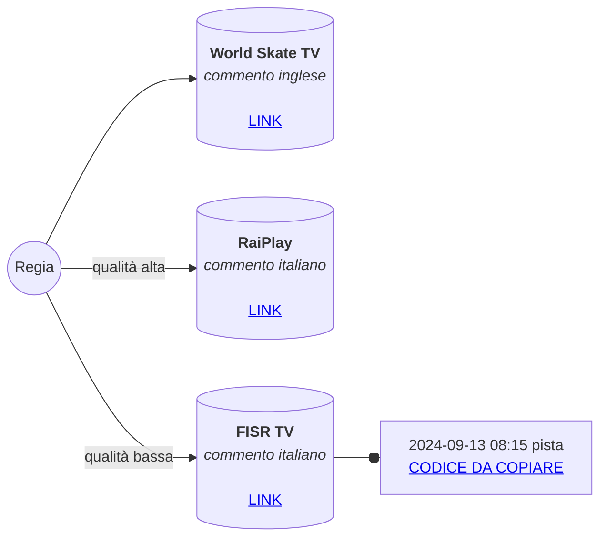

# WSG2024-video

## Indirizzi diretti

Copiare questi indirizzi e incollarli nel *browser* per guardare la diretta senza bisogno di un *account*.

Questi indirizzi possono essere incollati su [VLC](https://www.videolan.org/vlc/) (o su applicazioni simili) per registrare le trasmissioni video nel computer.

### FISR TV

##### FISR TV - 2024-09-13 08:15 pista

 `https://play.cdn.enetres.net/A217BCEBB2594BDF8FE2E65131DBF663023/022299/playlist.m3u8`

---

### World Skate TV

La World Skate permette il download diretto di queste registrazioni video.

| LINGUA | TITOLO | INDIRIZZO |
|---|---|---|
| Spagnolo | 1000m Senior Men Qualification | [link](https://progressive.enetres.net/getMedia.php?u=A217BCEBB2594BDF8FE2E65131DBF663&c=008&f=7f9b2cc0111b-140924-101230-livees.mp4) |
|  |  |  |
