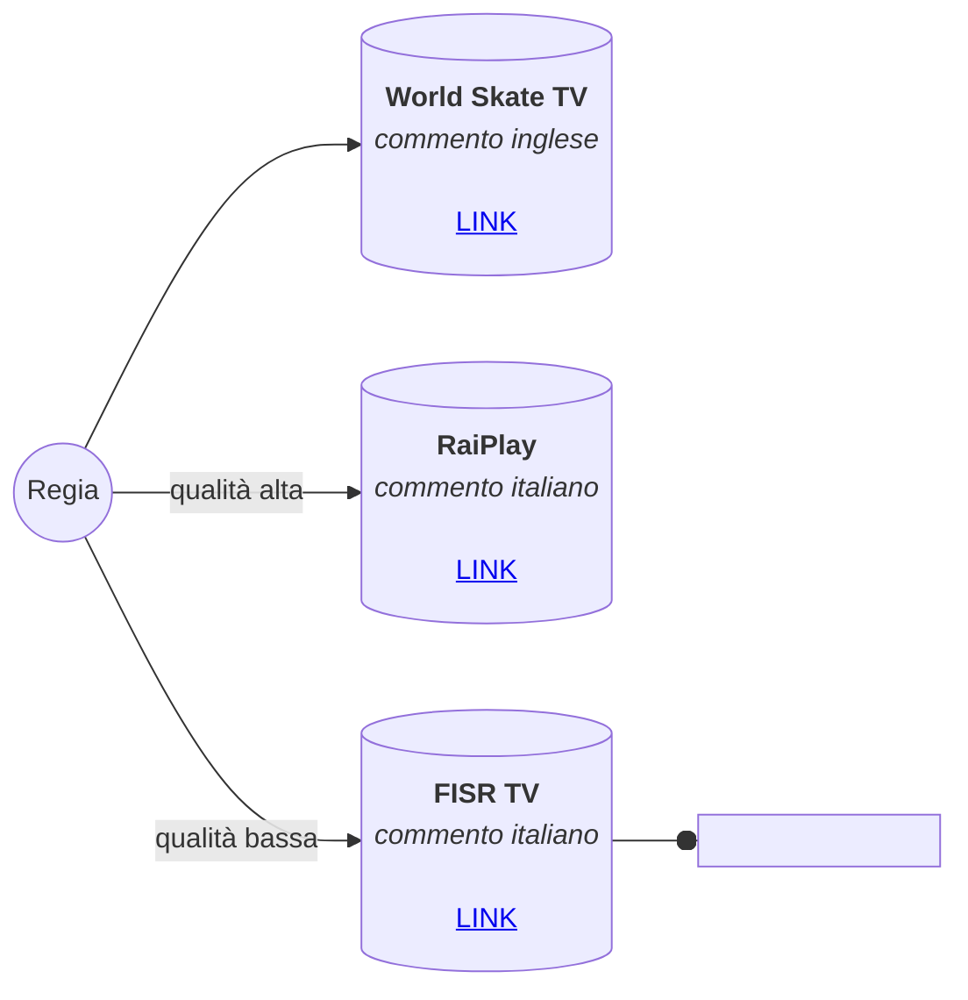

# WSG2024-video

```mermaid
flowchart LR
    Regia((Regia)) --> WSG[("<strong>World Skate TV</strong><br><i>commento inglese</i><br><br><a href="https://worldskate.tv/world-skate-games/wsg-2024/wsg-inline-speed-2024" target="_blank">LINK</a>")]
    Regia -- qualità alta --> Rai[("<strong>RaiPlay</strong><br><i>commento italiano</i><br><br><a href="https://www.raiplay.it/guidatv?channel=rai-sport" target="_blank">LINK</a>")]
    Regia -- qualità bassa --> FISR[("<strong>FISR TV</strong><br><i>commento italiano</i><br><br><a href="https://fisrtv.it/" target="_blank">LINK</a>")]
    FISR --o sorgente1["<img source="README/segnaposto.png">"]
```
