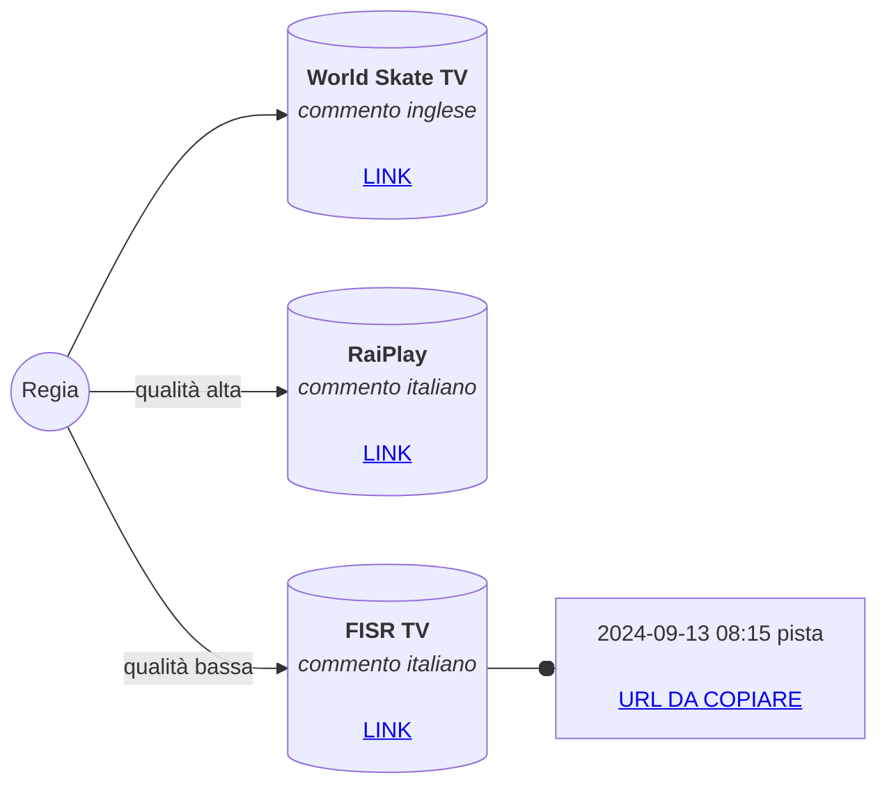

# WSG2024-video

```mermaid
flowchart LR
    Regia((Regia)) --> WSG[("<strong>World Skate TV</strong><br><i>commento inglese</i><br><br><a href="https://worldskate.tv/world-skate-games/wsg-2024/wsg-inline-speed-2024" target="_blank">LINK</a>")]
    Regia -- qualità alta --> Rai[("<strong>RaiPlay</strong><br><i>commento italiano</i><br><br><a href="https://www.raiplay.it/guidatv?channel=rai-sport" target="_blank">LINK</a>")]
    Regia -- qualità bassa --> FISR[("<strong>FISR TV</strong><br><i>commento italiano</i><br><br><a href="https://fisrtv.it/" target="_blank">LINK</a>")]
    FISR --o sorgente1["2024-09-13 08:15 pista<br><br><a href="#fisr-tv---2024-09-13-0815-pista">URL DA COPIARE</a>"]
```

## Codice sorgente

### FISR TV - 2024-09-13 08:15 pista

`https://play.cdn.enetres.net/A217BCEBB2594BDF8FE2E65131DBF663023/022299/playlist.m3u8`
